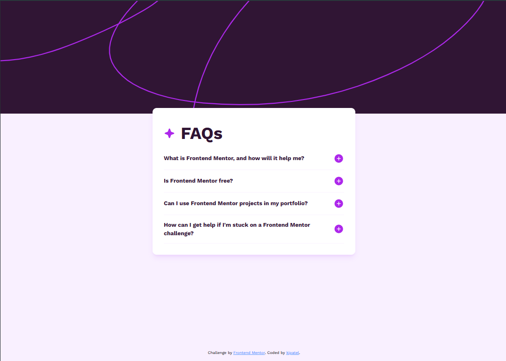

# Frontend Mentor - FAQ accordion solution

This is a solution to the [FAQ accordion challenge on Frontend Mentor](https://www.frontendmentor.io/challenges/faq-accordion-wyfFdeBwBz). Frontend Mentor challenges help you improve your coding skills by building realistic projects. 

### Screenshot

### Links

- [Live](https://kirtanpatel01.github.io/faq-accordion-fm/)

## My process

### Built with

- HTML5
- Tailwind CSS
- Javascript

## Author

- Website - [KJ_Patel Portfolio](https://kirtanpatel01.github.io/ARKA_WD_04)
- Frontend Mentor - [@kirtanpatel01](https://www.frontendmentor.io/profile/kirtanpatel01)
- Linkedin - [@kirtapatel01](https://www.linkedin.com/in/kirtanpatel01)