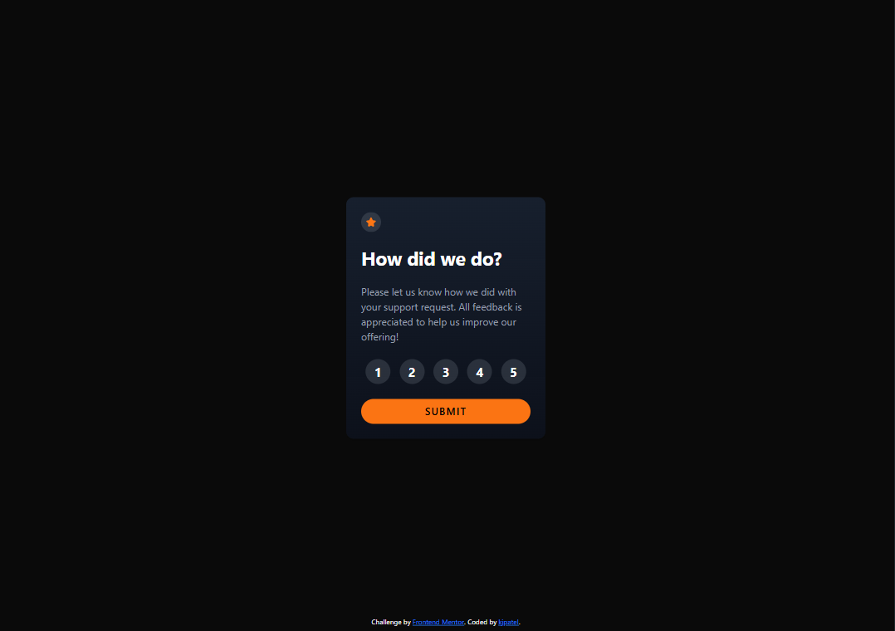

# Interactive rating component solution

This is a solution to the [Interactive rating component challenge on Frontend Mentor](https://www.frontendmentor.io/challenges/interactive-rating-component-koxpeBUmI). Frontend Mentor challenges help you improve your coding skills by building realistic projects. 

## Table of contents

- [Overview](#overview)
  - [Screenshot](#screenshot)
  - [Links](#links)
  - [Built with](#built-with)
- [Author](#author)

### Screenshot

### Links

- [Live](https://kirtanpatel01.github.io/rating-component-fm/)

## My process

### Built with

- HTML5
- Tailwind CSS
- Javascript

## Author

- Website - [KJ_Patel Portfolio](https://kirtanpatel01.github.io/ARKA_WD_04)
- Frontend Mentor - [@kirtanpatel01](https://www.frontendmentor.io/profile/kirtanpatel01)
- Linkedin - [@kirtapatel01](https://www.linkedin.com/in/kirtanpatel01)