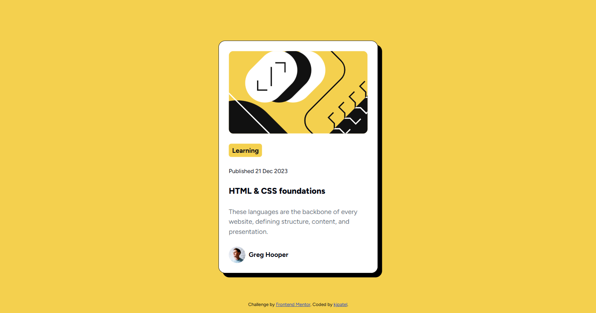

# Frontend Mentor - Blog preview card solution

This is a solution to the [Blog preview card challenge on Frontend Mentor](https://www.frontendmentor.io/challenges/blog-preview-card-ckPaj01IcS). Frontend Mentor challenges help you improve your coding skills by building realistic projects. 

## Table of contents

- [Overview](#overview)
  - [Screenshot](#screenshot)
  - [Links](#links)
- [My process](#my-process)
  - [Built with](#built-with)
- [Author](#author)

## Overview

### Screenshot

### Links

- Live Site URL: [Live](https://kirtanpatel01.github.io/blog-preview-card)

## My process
a
### Built with

- HTML5
- Tailwind CSS

### What I learned

I learned that don't stuck on how to code just start what you understand and what should be done. 
For example, first I wrote all the html part then I centered the card after that I worked on styling and lastly perfection. *"Don't jump directly on the prefection!"*

### Useful resources

- [Tailwindcss Docs](https://tailwindcss.com/docs) - This helped me to find the correct unitlity classes according to the usecase.

## Author

- Website - [KJ_Patel Portfolio](https://kirtanpatel01.github.io/ARKA_WD_04)
- Frontend Mentor - [@kirtanpatel01](https://www.frontendmentor.io/profile/kirtanpatel01)
- Linkedin - [@kirtapatel01](https://www.linkedin.com/in/kirtanpatel01)

